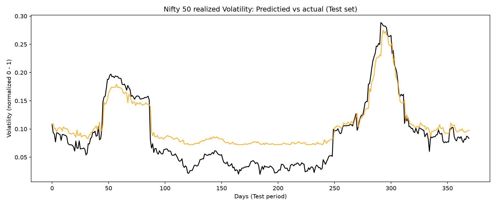

# Neural Network From Scratch — Nifty 50 Volatility Forecasting

A neural network built entirely from scratch in NumPy — forward pass,
backpropagation, mini-batch gradient descent, and momentum all
hand-derived and implemented without any ML framework — applied to
forecasting realized volatility on the Nifty 50 index.

## Why this project

Most "NN from scratch" projects stop at MNIST. This one goes further in
two ways: the math is fully hand-derived (see `derivations/derivations.md` for photographed, worked-out calculus), and the applied case study uses real Indian market data (Nifty 50) rather than a toy dataset — a genuine regression forecasting problem, not classification.

## What's implemented

- Single neuron → configurable `Dense` layer → chainable `NeuralNetwork` class
- Manually derived and coded backpropagation (verified via XOR)
- Mini-batch gradient descent with momentum
- Applied to Nifty 50 realized volatility forecasting:
  - Real data pulled via `yfinance`
  - Lagged features engineered with strict no-lookahead-bias discipline
  - Chronological train/test split (no shuffling across time)
  - Min-max target normalization (matched to sigmoid's output range)
  - Early stopping with best-weight restoration

## Results

| Model | Test Loss (normalized MSE) |
|---|---|
| Naive baseline (predict yesterday's volatility) | 0.344222 |
| From-scratch NN | 0.000777 |
| sklearn MLPRegressor (default hyperparameters) | 0.006189 |

The from-scratch network substantially outperforms the naive baseline.
**Note:** the sklearn comparison is not fully controlled (different
optimizer, learning rate schedule, and early stopping setup) — see
`derivations/derivations.md` (Day 8) for a full breakdown. It should not
be read as "hand-rolled SGD beats Adam."

### Known limitation

The model tracks volatility spikes well but systematically overestimates
during calm periods, likely because the training data contains more
spike-adjacent volatility than truly flat stretches. See prediction plot:



## Project structure
src/ - all runnable code (layers, network, training scripts)
data/ - raw and processed Nifty 50 datasets
derivations/ - hand-derived math, photographed, day by day
notebooks/ - plots and exploratory analysis

## Running it

```bash
cd src
pip install -r requirements.txt
python data_pipeline.py       # pulls and processes Nifty 50 data
python train_volatility.py    # trains and evaluates the network
```

