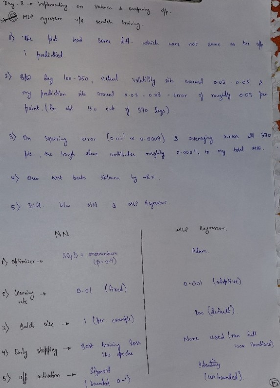

# Hand-Derived Math Notes

Derivations worked out on paper before implementation, for each stage of the network build.

## Day 1: Forward pass — single neuron

Forward pass for a single neuron: `z = w·x + b`, `a = activation(z)`.

## Day 2: Forward pass — Dense layer

Generalizing a single neuron to a full layer: `z = W·x + b` where `W` is a
weight matrix (one row per neuron), producing multiple outputs in one
matrix multiply.

## Day 3: Layer chaining

Chaining multiple layers together — each layer's activated output `a`
becomes the next layer's input.

## Day 4: Backpropagation — 2-layer XOR network

Full derivation of the backward pass for a network with:
- Input: 2 features
- Hidden layer: 2 neurons, sigmoid activation
- Output layer: 1 neuron, sigmoid activation
- Loss: MSE

### Key results

**Output layer error term:**
δ2 = (a2 - y) ⊙ a2(1 - a2)

**Output layer gradients:**
dL/dW2 = δ2 · a1ᵀ
dL/db2 = δ2

**Error propagated to hidden layer:**
dL/da1 = W2ᵀ · δ2

**Hidden layer error term:**
δ1 = (W2ᵀ · δ2) ⊙ a1(1 - a1)

**Hidden layer gradients:**
dL/dW1 = δ1 · xᵀ
dL/db1 = δ1

## Day 5: Mini-batch gradient descent + momentum

Momentum update rule — blends the current gradient with a running
"velocity" term to smooth updates and speed up convergence through flat
regions of the loss surface:

velocity = β · velocity + (1 - β) · gradient
W = W - learning_rate · velocity

## Day 6: Data pipeline — returns, realized volatility, feature engineering

**Problem framing:** predicting realized volatility (a measure of how much
a stock's price swings) is a **regression problem** — the output is a
continuous number, not a class label.

**Key pandas operations used:**

1. **`pct_change()`** — computes daily return:
   `(today's price - yesterday's price) / yesterday's price`

2. **`.rolling(window=21).std()`** — looks at the last 21 days of returns
   and computes their standard deviation. This is "realized volatility" —
   it captures how much the price has been swinging recently, regardless
   of direction.

3. **`dropna()`** — the first 21 rows have `NaN` for volatility, since
   there isn't enough history yet to compute a full 21-day window.
   `dropna()` removes these incomplete rows.

**Feature engineering (avoiding lookahead bias):** features use *lagged*
(yesterday's) values only — `Return_lag1`, `Return_lag2`,
`Volatility_lag1` — since on any given day you only know yesterday's
completed data, not today's, when trying to forecast today's volatility.

## Day 7: Training on real Nifty 50 data — normalization & chronological split

**Why normalize before training:** volatility values are tiny (~0.006-0.007)
while returns can be slightly positive or negative (~±0.01). Neural nets
based on sigmoid/tanh activations struggle when inputs are on very
different scales or very small — gradients can vanish or updates can
become unstable. Fix: standardize each feature (subtract mean, divide by
standard deviation) so everything is roughly on the same scale
(mean 0, std 1).

**Why the train/test split must be chronological:** time-series data must
never be shuffled before splitting. Shuffling lets the model effectively
"see" future data during training and get evaluated on the past — a form
of lookahead bias in the split itself. The fix: split by time — train on
the earlier portion, test strictly on the later portion.

## Day 8: Validating against sklearn, honest result analysis

**Sanity check:** compared the from-scratch network against
`sklearn.MLPRegressor` on the same normalized Nifty 50 data.

**Result:** the from-scratch NN scored a test loss of `0.000777`, roughly
8x better than sklearn's `0.006189`. Initially this looked like a strong
result, but on inspection it isn't a fair comparison — the two models
used very different training setups:

| | From-scratch NN | sklearn MLPRegressor (defaults) |
|---|---|---|
| Optimizer | SGD + momentum (β=0.9) | Adam |
| Learning rate | 0.01 (fixed) | 0.001 (adaptive) |
| Batch size | 1 (per-example) | 200 (default) |
| Early stopping | Yes, best-weight restore | No (ran full 1000 iterations) |
| Output activation | Sigmoid (bounded 0-1) | Identity (unbounded) |

Since my network was hand-tuned (learning rate adjusted after an overflow
bug, early stopping added) while sklearn ran on untouched defaults, the
comparison favors my model unfairly. The honest conclusion is that this
comparison is not fully controlled, not that hand-rolled SGD beats Adam.

**A more interesting, genuine finding:** plotting predictions vs actual
volatility shows the network tracks volatility *spikes* well, but
systematically *overestimates* during calm periods (e.g. actual ~0.03-0.05
vs predicted ~0.07-0.08 between test days 100-250). Likely cause: the
training data contains more "spike-adjacent" volatility than truly flat,
ultra-calm stretches, so the network learned to predict something close
to a recent average — which tracks spikes reasonably but overshoots
genuinely quiet periods.

## Day 9: Attempting to fix calm-period overestimation — a negative result

**Hypothesis:** the model overestimates volatility during calm periods
because it only sees yesterday's single volatility value, which doesn't
capture whether calm has persisted. Adding a longer-window feature
(`Volatility_ma10_lag1`, a 10-day rolling average of volatility, lagged
by 1) should give the network "regime" information and reduce this bias.

**Result: the hypothesis was not supported.**

| | 3 features (Day 7-8) | 4 features (+ MA10) |
|---|---|---|
| Test Loss | 0.000777 | 0.001255 |

Adding the feature made test performance *worse*. More strikingly, the
prediction plot showed the model producing a **perfectly flat prediction**
(~0.085) across the entire calm-period stretch (test days ~100-250) —
not just biased, but constant regardless of the actual input values.

**Diagnosis: dying ReLU.** A flat output across a wide input range is a
classic signature of one or more ReLU neurons being permanently "dead"
(outputting 0) for that entire input region — when a neuron's
pre-activation is negative for a whole range of inputs, it contributes
nothing, and the network effectively collapses to a simpler function
there. Adding the 4th feature likely shifted the weight landscape enough
to push hidden neurons into this dead zone specifically for calm-period
inputs.

**Decision:** reverted to the 3-feature model (`Return_lag1`,
`Return_lag2`, `Volatility_lag1`) as the final version, since it
outperforms the 4-feature version and doesn't exhibit dead-neuron
behavior. A natural next step (not pursued here, in the interest of
time) would be trying Leaky ReLU or reinitializing weights to test
whether the dying-neuron problem — rather than the feature itself — was
the actual cause of the regression.