# Hand-Derived Math Notes

Derivations worked out on paper before implementation, for each stage of the network build.

## Day 1: Forward pass — single neuron

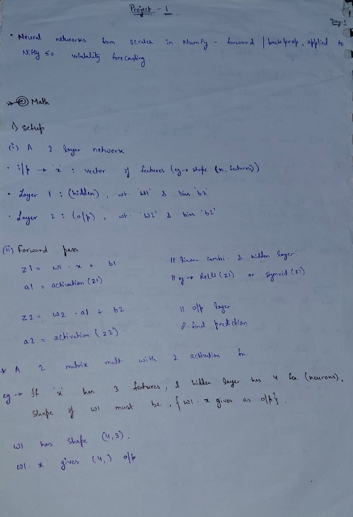

Forward pass for a single neuron: `z = w·x + b`, `a = activation(z)`.

## Day 2: Forward pass — Dense layer

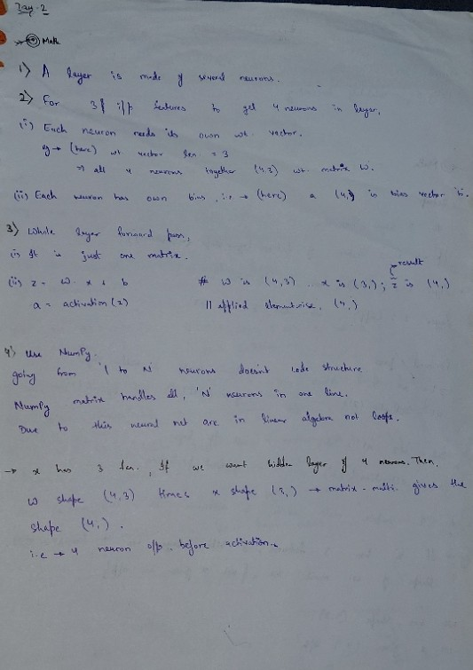

Generalizing a single neuron to a full layer: `z = W·x + b` where `W` is a
weight matrix (one row per neuron), producing multiple outputs in one
matrix multiply.

## Day 3: Layer chaining

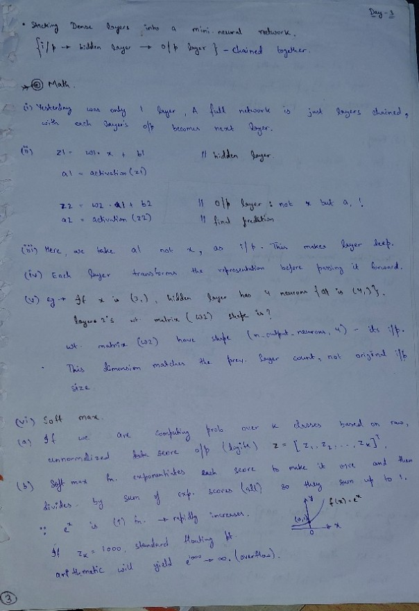
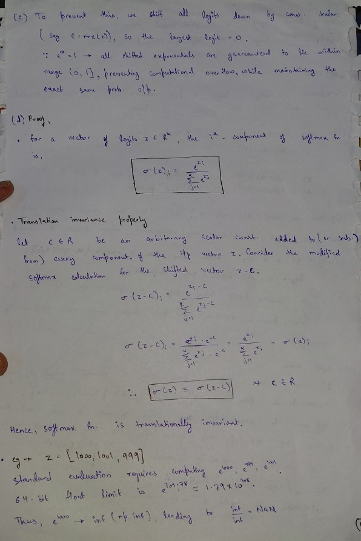
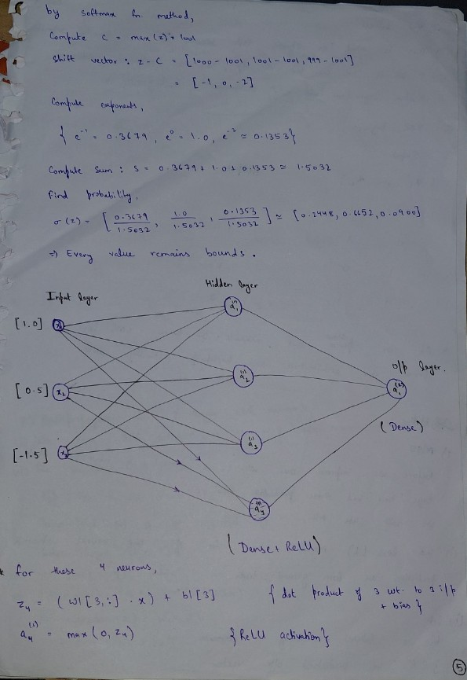

Chaining multiple layers together — each layer's activated output `a`
becomes the next layer's input.

## Day 4: Backpropagation — 2-layer XOR network

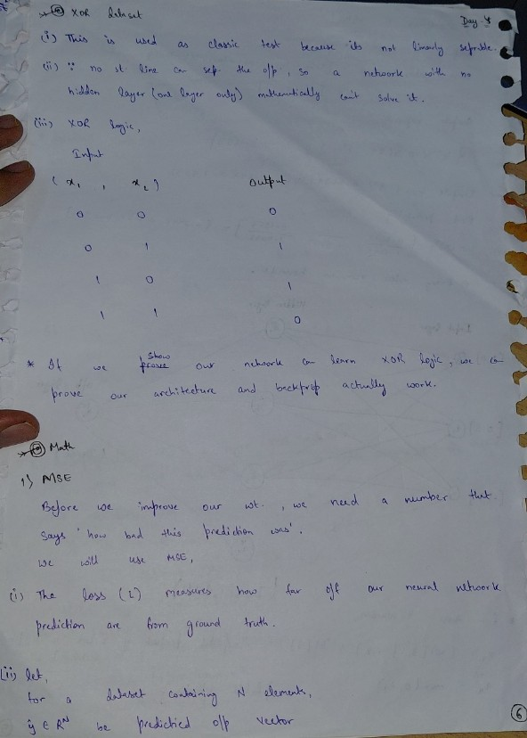
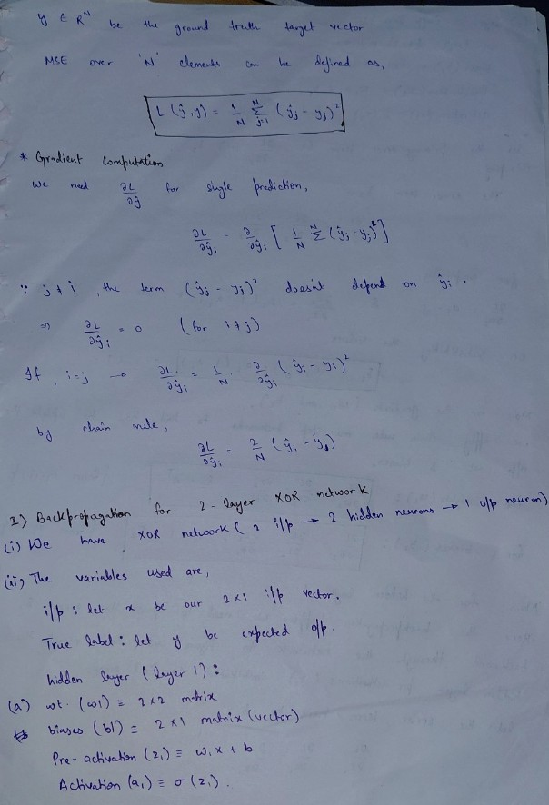
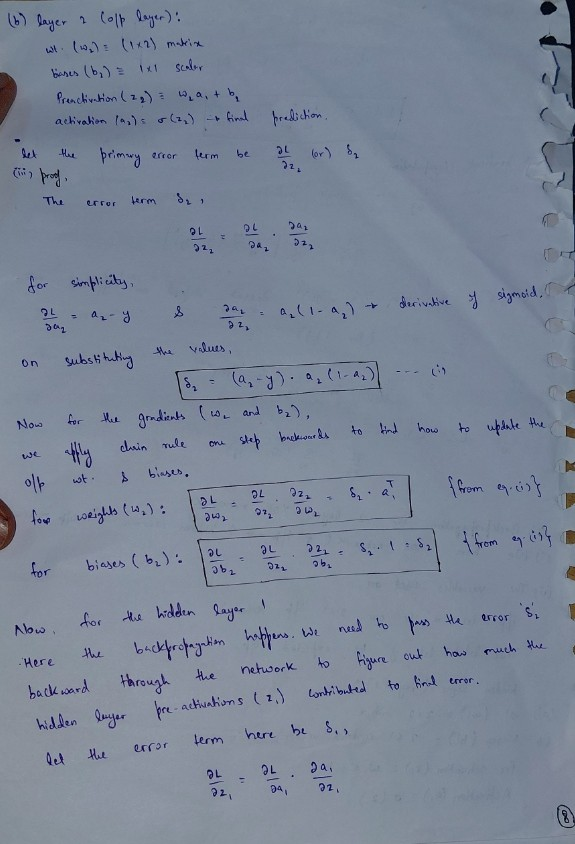
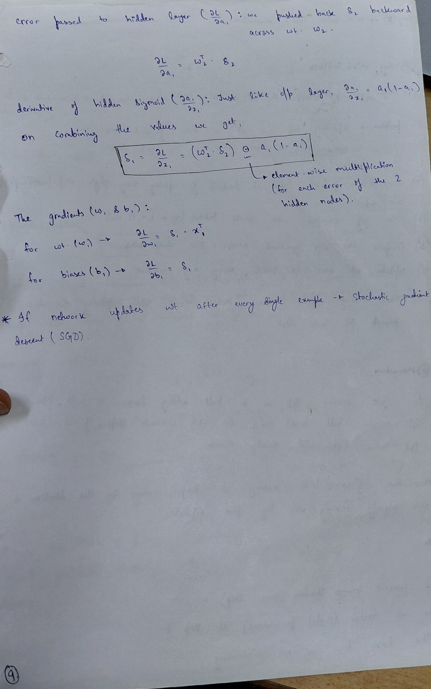

Full derivation of the backward pass for a network with:
- Input: 2 features
- Hidden layer: 2 neurons, sigmoid activation
- Output layer: 1 neuron, sigmoid activation
- Loss: MSE

### Key results

**Output layer error term:**
δ2 = (a2 - y) ⊙ a2(1 - a2)

**Output layer gradients:**
dL/dW2 = δ2 · a1ᵀ
dL/db2 = δ2

**Error propagated to hidden layer:**
dL/da1 = W2ᵀ · δ2

**Hidden layer error term:**
δ1 = (W2ᵀ · δ2) ⊙ a1(1 - a1)

**Hidden layer gradients:**
dL/dW1 = δ1 · xᵀ
dL/db1 = δ1

## Day 5: Mini-batch gradient descent + momentum

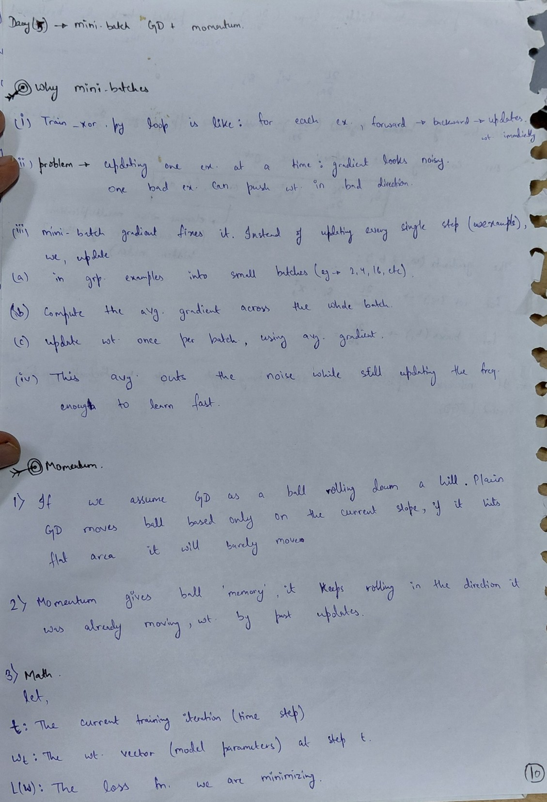
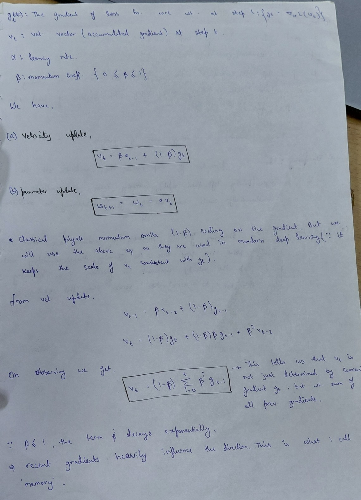
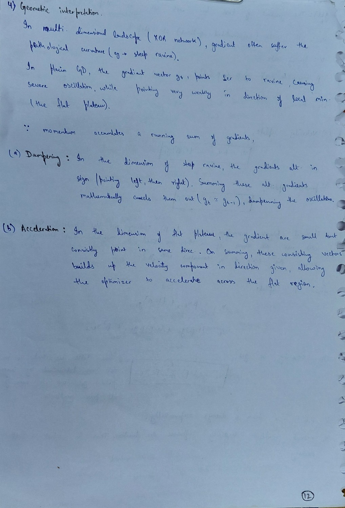

Momentum update rule — blends the current gradient with a running
"velocity" term to smooth updates and speed up convergence through flat
regions of the loss surface:

velocity = β · velocity + (1 - β) · gradient
W = W - learning_rate · velocity

## Day 6: Data pipeline — returns, realized volatility, feature engineering

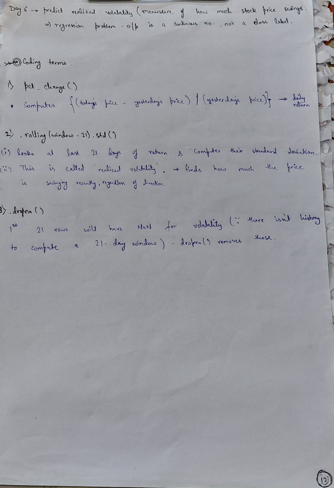

**Problem framing:** predicting realized volatility (a measure of how much
a stock's price swings) is a **regression problem** — the output is a
continuous number, not a class label.

**Key pandas operations used:**

1. **`pct_change()`** — computes daily return:
   `(today's price - yesterday's price) / yesterday's price`

2. **`.rolling(window=21).std()`** — looks at the last 21 days of returns
   and computes their standard deviation. This is "realized volatility" —
   it captures how much the price has been swinging recently, regardless
   of direction.

3. **`dropna()`** — the first 21 rows have `NaN` for volatility, since
   there isn't enough history yet to compute a full 21-day window.
   `dropna()` removes these incomplete rows.

**Feature engineering (avoiding lookahead bias):** features use *lagged*
(yesterday's) values only — `Return_lag1`, `Return_lag2`,
`Volatility_lag1` — since on any given day you only know yesterday's
completed data, not today's, when trying to forecast today's volatility.